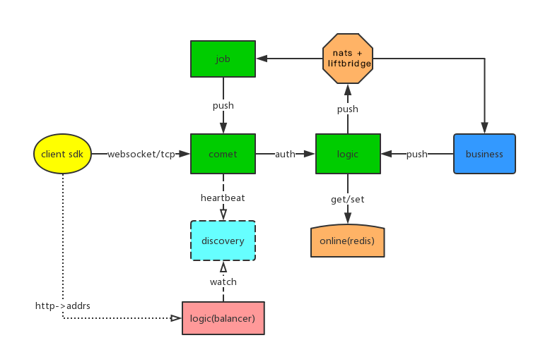

# goim via nats
fork from [goim](https://github.com/Terry-Mao/goim)  and support nats  to replace kafka / zookeeper


## chinese note 中文说明
goim 是 非常成功的 IM ( 即时消息平台), 依赖项为 kafka ( 消息队列) + zookeeper ( 分布式扩展) + bilibili/discovery( 服务发现与均衡) , 由于 kafka / zk 在部署上与 golang 的单一可执行文件相比, 稍复杂, 加上为简化运维, 所以, 这里 fork 了 goim 并修改为 nats

由于修改比较大, 暂时用新的 repo 来进行代码管理, 以后看情况是否能回归到 Terry-Mao 的主线版本上. 

## 主要变更

1. 消息队列修改为 [nats](https://github.com/nats-io/gnatsd) + [liftbridge](https://github.com/liftbridge-io/liftbridge)  注:  [liftbridge](https://github.com/liftbridge-io/liftbridge) 替代了 [nats-streaming-server](https://github.com/nats-io/nats-streaming-server) , 相关信息参见[liftbridge介绍文章](https://bravenewgeek.com/introducing-liftbridge-lightweight-fault-tolerant-message-streams/)
2. 日志替换为 [uber-go/zap](https://github.com/uber-go/zap), 替换原一是因为 zap 快一点, 二是个人更为熟悉这个日志库 

## TODO
1. 抽取 discovery / kafka 部分为 interface 
2. 增加测试
3. 增加修改变更说明文档


goim v2.0
==============
[](https://travis-ci.org/Terry-Mao/goim) 
[](https://goreportcard.com/report/github.com/Terry-Mao/goim)
[](https://codecov.io/gh/Terry-Mao/goim)

goim is a im server writen by golang.

## Features
 * Light weight
 * High performance
 * Pure Golang
 * Supports single push, multiple push and broadcasting
 * Supports one key to multiple subscribers (Configurable maximum subscribers count)
 * Supports heartbeats (Application heartbeats, TCP, KeepAlive, HTTP long pulling)
 * Supports authentication (Unauthenticated user can't subscribe)
 * Supports multiple protocols (WebSocket，TCP，HTTP）
 * Scalable architecture (Unlimited dynamic job and logic modules)
 * Asynchronous push notification based on Kafka

## Architecture


## Quick Start

### Build
```
    make build
```

### Run
```
    make run
    make stop

    // or
    nohup target/logic -conf=target/logic.toml -region=sh -zone=sh001 deploy.env=dev weight=10 2>&1 > target/logic.log &
    nohup target/comet -conf=target/comet.toml -region=sh -zone=sh001 deploy.env=dev weight=10 addrs=127.0.0.1 2>&1 > target/logic.log &
    nohup target/job -conf=target/job.toml -region=sh -zone=sh001 deploy.env=dev 2>&1 > target/logic.log &

```
### Environment
```
    env:
    export REGION=sh
    export ZONE=sh001
    export DEPLOY_ENV=dev

    supervisor:
    environment=REGION=sh,ZONE=sh001,DEPLOY_ENV=dev

    go flag:
    -region=sh -zone=sh001 deploy.env=dev
```
### Configuration
You can view the comments in target/comet.toml,logic.toml,job.toml to understand the meaning of the config.

### Dependencies
[Discovery](https://github.com/Bilibili/discovery)

[Kafka](https://kafka.apache.org/quickstart)

## Document
[Protocol](./docs/protocol.png)

[English](./README_en.md)

[中文](./README_cn.md)

## Examples
Websocket: [Websocket Client Demo](https://github.com/Terry-Mao/goim/tree/master/examples/javascript)

Android: [Android](https://github.com/roamdy/goim-sdk)

iOS: [iOS](https://github.com/roamdy/goim-oc-sdk)

## Benchmark


### Benchmark Server
| CPU | Memory | OS | Instance |
| :---- | :---- | :---- | :---- |
| Intel(R) Xeon(R) CPU E5-2630 v2 @ 2.60GHz  | DDR3 32GB | Debian GNU/Linux 8 | 1 |

### Benchmark Case
* Online: 1,000,000
* Duration: 15min
* Push Speed: 40/s (broadcast room)
* Push Message: {"test":1}
* Received calc mode: 1s per times, total 30 times

### Benchmark Resource
* CPU: 2000%~2300%
* Memory: 14GB
* GC Pause: 504ms
* Network: Incoming(450MBit/s), Outgoing(4.39GBit/s)

### Benchmark Result
* Received: 35,900,000/s

[中文](./docs/benchmark_cn.md)

[English](./docs/benchmark_en.md)

## LICENSE
goim is is distributed under the terms of the MIT License.